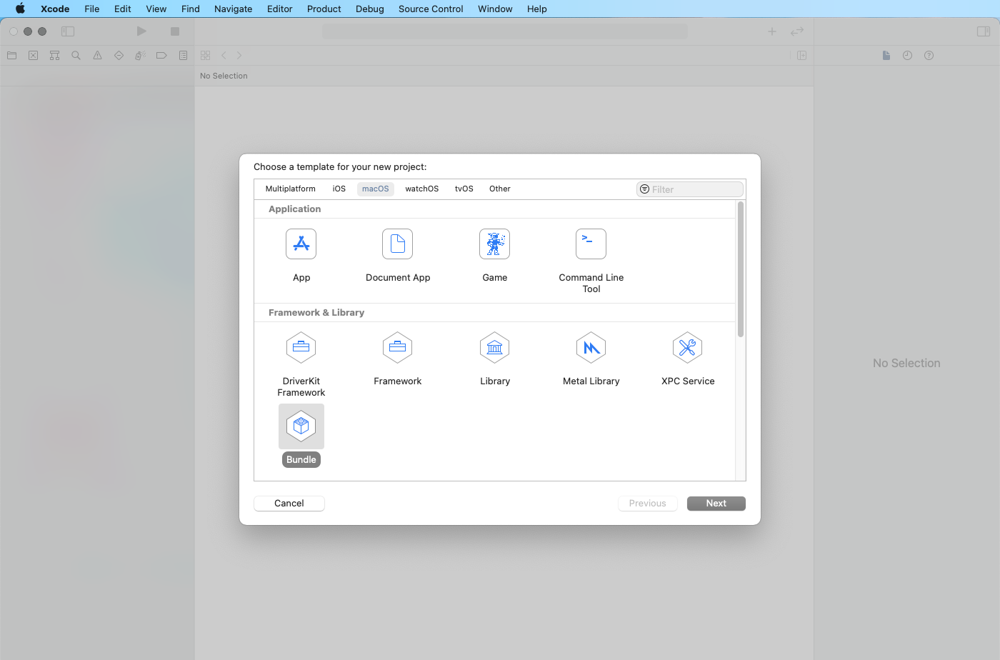

Unity Native PluginはiOSの場合にはソースコードをAssets/Plugins/iOSに入れますが、    
macOSなどの場合はビルド済みのライブラリ（macOSではbundle）をつくる必要があります。    
Editorで動かしたい場合などに必要となるのでXcodeでbundleのプロジェクトを新規作成します。



適当にコードを書きます。

```
#import <Cocoa/Cocoa.h>
NSWindow *win = nil;

extern "C" void onAwake() {
    if(win==nil) {
        dispatch_async(dispatch_get_main_queue(),^{
            win = [[NSWindow alloc] initWithContentRect:CGRectMake(0,0,960,540) styleMask:1 backing:NSBackingStoreBuffered defer:NO];
            [win makeKeyAndOrderFront:nil];
        });
    }
}
extern "C" void onDestroy() {
    if(win) {
        dispatch_async(dispatch_get_main_queue(),^{
            [win setReleasedWhenClosed:NO];
            [win close];
            win = nil;
        });
        
    }
}
```

ビルドするとbundleができるのでAssets/Plugins/に置きます。    
GameObjectを作りBehaviourScriptをアタッチします。    
作成したbundle名がTest.bundleだった場合にDllImportされる名称はTestになりますので、任意の名前に変更してください。

```
using System.Collections;
using System.Collections.Generic;
using UnityEngine;
using System.Runtime.InteropServices;

public class NewBehaviourScript : MonoBehaviour
{
	[DllImport ("Test")]
	private static extern void onAwake();

	[DllImport ("Test")]
	private static extern void onDestroy();

	void Awake() {
		onAwake();
	}

	void Start() {}
	void Update() {}

	void OnDestroy() {
		onDestroy();
	}
}
```

Editrで再生するとウィンドウが立ち上がります。    
停止するとウィンドウが消えます。
